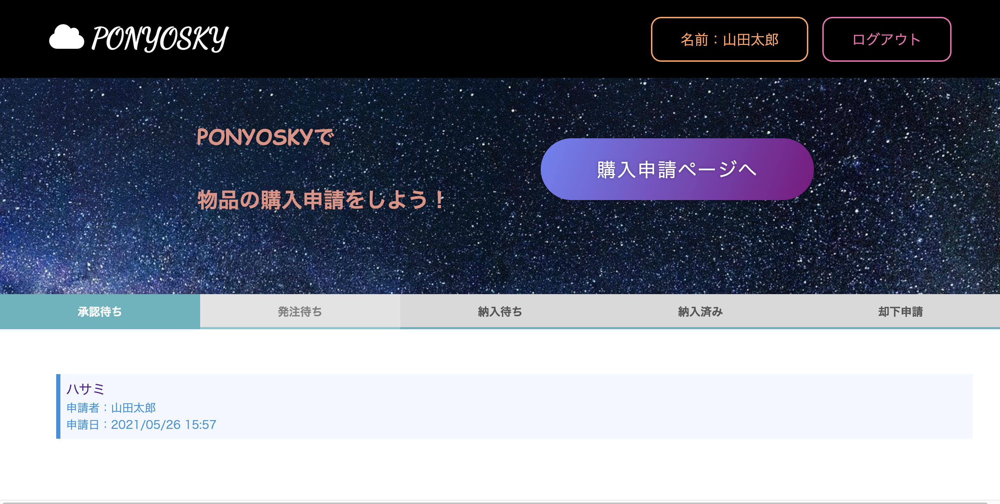

# アプリ名
PONYOSKY

# 概要
社内での購入申請アプリ。  
①ユーザー(誰でも)は備品の購入申請をすることができる。  
②ユーザー(課長)は購入申請を承認及び却下することができる。  
③購入申請が承認された場合は、ユーザー(工具室)が発注処理をすることができる。  
④ユーザー(工具室)が発注処理をした申請は納入待ちとなる。  
⑤ユーザー(受入グループ)は納入待ちの申請が納入されると、納入処理をできる。  
以上の流れで申請が進んでいくが、それぞれ現状どの状況にあるか、確認できるようになっている。  

# 本番環境
http://35.73.229.91/  
Basic認証  
ユーザー: admin  
パスワード: 2222

# 使い方
`$ git clone https://github.com/d-cho623/ponyosky.git`  
`$ cd hoge`    
`$ bundle install`  
`$ rails db:create`  
`$ rails db:migrate`  
`$ rails s`  
👉 http://localhost:3000  
ログインページにゲストログイン機能があります。
役職ごとに行えることが違うので、各役職でゲストログインできるようにしています。

# 制作背景
前職で、工場側の人と話をした時に商品の購入処理が面倒という話を聞いたことがありました。  
具体的には、申請書を作成して課長に持っていき承認をもらったら、発注グループに発注申請をする。  
発注グループは発注をするが、申請した本人は本当に発注されているのか？まだ発注されていないのか？  
状況が全くわからないようでした。  
そのため、それらが一つのアプリケーションで管理できたら非常に便利だと思い、今回のPONYOSKYを作成しました。  

# DEMO
### トップページ  
トップページでは、申請のステータス（状況）が一覧で見ることができます。  
ここから申請の詳細ページに遷移することで、承認等のアクションをすることができます。  
  
  
### 購入申請ページ〜申請後  
購入申請ページで各カラムに入力し申請すると、トップページに遷移します。  
またトップページには、作成した申請が承認待ちのステータスとして追加されます。
  
  
### 申請承認(役職:課長でログインします)  
課長ユーザーが申請詳細ページに行くと、"承認する"及び"却下する"ボタンが表示されます。  
承認するとトップページに遷移し、申請は発注待ちのステータスとなります。  
同様に発注待ちステータスの申請は、役職:発注グループでログインすると発注済みのボタンが表示され、クリックすると納入待ちのステータスとなります。  
最後に納入待ちステータスの申請は、役職：受入グループでログインすると納入済みのボタンが表示され、クリックすると納入済みのステータスとなります。  
  
  
### 申請却下(役職：課長でログインします)
課長ユーザーが申請を却下すると、トップページに遷移し、申請は却下申請のステータスに入ります。  

# 工夫したポイント
- 申請詳細ページにコメント欄を用意し、いつ発注したかやいつ納入されたかをコメントとして残すことができるようにしました。  
- 承認ボタンや発注ボタンは押しミスに対応するため、取り消しができるようにしました。  
- ログアウト状態で状態で表示されるトップページに、アプリケーションの詳細説明を記述しました。  
- 申請内容は編集及び削除ができるようにしました。

# 使用技術（開発環境)
## バックエンド
Ruby , Ruby on rails

## フロントエンド 
Haml , CSS , JavaScript  

## データベース
MySQL , SequelPro

# 課題や今後実装したい機能
- よく申請する物品は、リストから申請できるようにしたい。  
- 納入処理された商品は、それ用のページを作り、一覧として見れるようにしたい。 
- 申請の際に見積書等が必要になるケースもあると思うので、PDFが添付できるようにしたい。
- 申請履歴から選択して申請を作成できるようにしたい。

# テーブル設計

## users テーブル

| Column               | Type   | Options                   |
| ---------------      | ------ | ------------------------  |
| name                 | string | null: false               |
| email                | string | null: false, unique: true |
| encrypted_password   | string | null: false               |
| occupation_id        | integer| null: false               |
| uid                  | string | null: false               |
| workplace_id         | integer| null: false               |
| group_id             | integer| null: false               |

### Association
- has_many :items
- has_many :approvals
- has_many :rejects
- has_many :comments

## items テーブル

| Column                  | Type       | Options                        |
| ----------------------  | ------     | ----------------------------   |
| maker                   | string     | null: false                    |
| name                    | string     | null: false                    |
| number                  | integer    | null: false                    |
| code                    | integer    | null: false                    |
| quantity                | integer    | null: false                    |
| price                   | integer    | null: false                    |
| total_price             | integer    | null: false                    |
| trading_company         | string     | null: false                    |
| retrieval               | string     | null: false                    |
| user                    | references | null: false, foreign_key: true |

### Association
- belongs_to :user
- has_many :approvals
- has_many :rejects
- has_many :comments

## approvals テーブル

| Column                  | Type           | Options                        |
| ----------------------  | -------------- | ----------------------------   |
| user                    | references     | null: false,foreign_key: true  |
| item                    | references     | null: false,foreign_key: true  |

### Association
- belongs_to :user
- belongs_to :item

## rejects テーブル

| Column                  | Type           | Options                        |
| ----------------------  | -------------- | ----------------------------   |
| user                    | references     | null: false,foreign_key: true  |
| item                    | references     | null: false,foreign_key: true  |

### Association
- belongs_to :user
- belongs_to :item

## comments テーブル

| Column                  | Type           | Options                        |
| ----------------------  | -------------- | ----------------------------   |
| text                    | text           | null: false                    |
| user                    | references     | null: false,foreign_key: true  |
| item                    | references     | null: false,foreign_key: true  |

### Association
- belongs_to :user
- belongs_to :item
